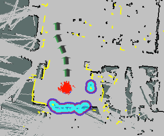

# stage_navigator

20/10

[シミュレータstage及び関連パッケージのインストール](https://robot.isc.chubu.ac.jp/?p=932)

[cirkit_waypoint_manager](https://github.com/CIR-KIT/cirkit_waypoint_manager)

cirkit_waypoint_managerをstage上でやってみるだけのやつ

### waypointでナビゲーション

~~~
$ roslaunch stage_navigator stage_navigation.launch 
2D Pose Estimateの矢印で正しい位置を指定
矢印キーでくるくるしてパーティクルを集める
~~~

~~~
$ roslaunch stage_navigator waypoint_generator.launch
矢印キーで動かす
$ rosrun cirkit_waypoint_generator cirkit_waypoint_saver 
launchファイルからの起動では保存されない時があるためrosrunで起動
~~~

~~~
$ roslaunch stage_navigator waypoint_navigator.launch
~~~

